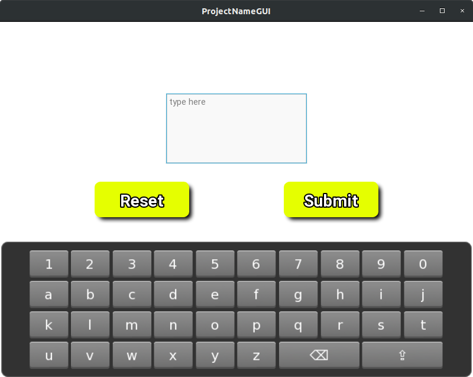

# Keyboard App

## Overview
This example is useful if you want a user to have a touch screen keyboard to interact with. For example, if you make a
Kivy UI using a Raspberry Pi and a touch screen display, which the DPEA usually does. 

Something to note is the placement of the `Config.set` lines. These lines have to be at the top of the program for the
on-screen keyboard to appear. Otherwise, the keyboard does not always pop up.

The keyboard itself is designed within the `simple.json` file. The purpose of this custom keyboard is to limit what the
user can type in to the text box. They are limited to letters (upper and lower case), numbers, and backspace.

## Making Sure Kivy Recognizes `simple.json`
In order for Kivy to recognize our custom keyboard file, we need to place `simple.json` inside of Kivy's keyboard folder.
You can do so by first finding the location of your Kivy keyboards. You will have something similar to 
`/home/soft-dev/packages/RaspberryPiCommon/kivy_venv/lib/python3.8/site-packages/kivy/data/keyboards`

Then all you have to do is copy `simple.json` into that folder by typing something similar to the following into your terminal.
```
cd /home/soft-dev/Documents/KivyExamples/OnScreenKeyboardApp
cp simple.json /home/soft-dev/packages/RaspberryPiCommon/kivy_venv/lib/python3.8/site-packages/kivy/data/keyboards
```
Your path might change depending on where you cloned this repo as well as where your `kivy_venv` is installed.


## Running the App
Ensure you are using a python interpreter with Kivy installed, navigate to the CountdownApp folder, and run the following
in your terminal --
```
python3 keyboard_example.py
```

If everything was done correctly, you should see the following when you click/touch the text box --
